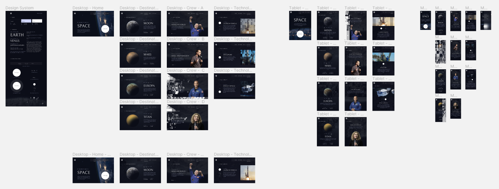

# Space Tourism

## 2 key folders
### Angular
Here is the implementation of the website has an angular static web page.
- URL: https://royer-space-tourism.vercel.app/
### React-front-end
React | Typescript | Apollo GraphQL | SASS | SCSS modules

The React implementation. It depends on the server folder's server to get the data to populate the pages.
 
- URL: https://react-spacetourism.vercel.app/
### Server
Apollo GraphQL with Postgress database empowers Knex to hold the front-end data.
- URL: https://royer-space-tourism-website.herokuapp.com/

>**Select one of the folders for specific information.**