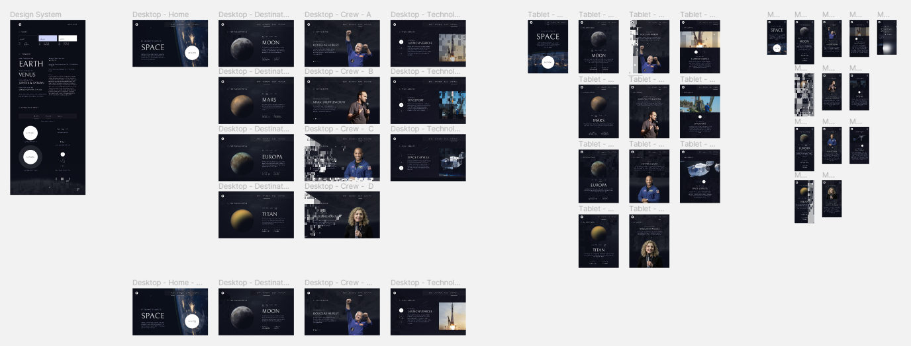

# Space Tourism

The maintained application is the root Next.js project. It preserves the four original entry paths and the official Frontend Mentor content. The historical Angular, React/Apollo and server projects remain below for reference; their packages are not part of the root install or build.

## Run and verify

Use Node 24, then `npm ci` and `npm run dev`. The local app uses port4391. `npm run build` creates the production application; `npm start` serves that build. No environment variables, API, account or database are required.

Run `npm run lint`, `npm run typecheck`, `npm audit --omit=dev` and `npm run build`. `npm test` then starts an owned production server and runs the browser suite in installed Google Chrome with two workers, stopping the server on completion. It covers all content views, stable links/history, unknown routes, keyboard and no-JavaScript navigation, responsive image geometry and reduced motion. Generated screenshots/results stay ignored in `.test-state/`.

## Routes and navigation

- `/` is home.
- `/destination` is Moon. Mars, Europa and Titan have `/destination/<name>` paths.
- `/crew` is Douglas Hurley. The other crew members have their hyphenated full-name child paths.
- `/technology` is Launch vehicle. Spaceport and Space capsule have child paths.

Links are normal document navigation, so every content choice works without JavaScript and survives refresh/back/forward. Unknown selections return404. Default-member child aliases redirect to the original parent paths.

The phone menu is a native disclosure: Enter or Space toggles it with or without JavaScript, and with JavaScript Escape closes it and returns focus. Typing never triggers navigation.

All content is static initial HTML. Local fonts and supplied images avoid third-party runtime requests.

## Design

Live: https://space-tourism.royeradames.com/

The layouts follow the official Figma frames for every page at mobile (375), tablet (768) and desktop (1440): the 88/96/136 px headers, the blurred numbered link bar, the 254 px blurred phone menu, the 150/300/480 px planets, the crew copy-dots-portrait order with a faded portrait foot, and the full-bleed technology image with the 40/56/80 px numbered pager. Layout switches at 768 and 1100 px. The design's 14 and 15 px text is raised to the 16 px floor. `og:site_name` and WebSite JSON-LD name the site "Space Tourism", and every route has its own canonical URL. `tests/design.spec.ts` checks the frames, hover states, site identity and every width from 320 to 1600 px in 10 px steps; `PORT` overrides the test port 4391.

An earlier version had an invented "Keyboard help" panel with character shortcuts. It was not in the design and broke the layout at narrow widths, so it was removed.

## Source and licenses

Content and imagery come from [Frontend Mentor's official Space Tourism starter](https://github.com/frontendmentorio/space-tourism-website), revision1e046e6dfd08fbf3cc6a50b3babe9111701d77c1. `reference/official-brief.md` records the brief; `lib/content.json` preserves the supplied words and data. Fonts are Barlow, Barlow Condensed and Bellefair from [Google Fonts](https://github.com/google/fonts), with their OFL licenses beside the local files in `app/fonts/`.

For deployment, use this repository's root as the Next.js project directory. Changing existing hosting settings is a separate release step; this source does not modify old deployments or the historical API.

## Historical implementation record

# Space Tourism

## 2 key folders

### Angular

Here is the implementation of the website has an angular static web page.

- URL: https://royer-space-tourism.vercel.app/

### React-front-end

React | Typescript | Apollo GraphQL | SASS | SCSS modules

The React implementation. It depends on the server folder's server to get the data to populate the pages.

- URL: https://react-spacetourism.vercel.app/

### Server

Apollo GraphQL with Postgress database empowers Knex to hold the front-end data.

- URL: https://royer-space-tourism-website.herokuapp.com/

> **Select one of the folders for specific information.**
